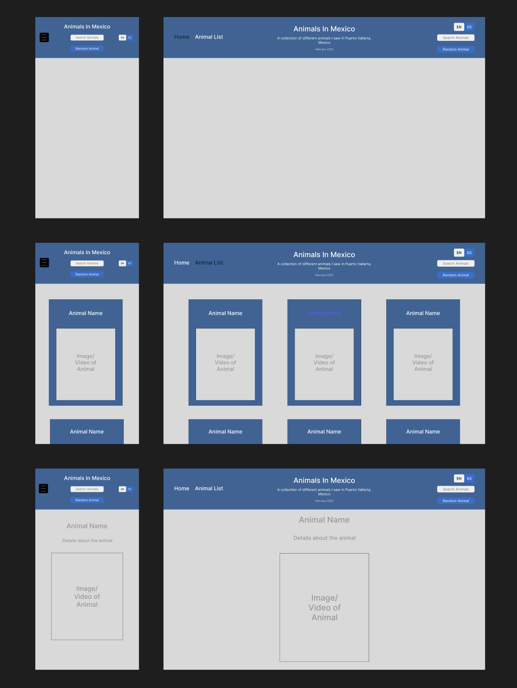

# ACS-3320
## Assignment: Web Design Project

### Change Log / Notes
Link to [figma](https://www.figma.com/design/2WP9tvimJP3G74NY1llwhc/Untitled?node-id=0-1&t=J9gvvROinYUyTvC7-1)

#### Initial Thoughts
- This project was originally an assignment for ACS-1320. This project redesign is to implement new advanced CSS features, and to look at the design from a higher level and look for areas of improvement. The emphasis being on the user's experience. 
- My home page originally featured a Google map link displaying the location. I wasn’t happy with how it looked, so I decided to remove the map and redesign the home page.
- When first selecting the font, I didn’t give it much thought. I wanted to revisit that decision and perhaps choose something different.
- I wasn’t upset with the layout, but the cards weren’t all the exact same size. I wanted to modify some of the CSS properties to maintain the same size (e.g., flex shrink).
- My color choice was very random, and some of the text wasn’t very readable. I liked the background image, but the color of the cards and the text could definitely be improved.

#### Updates
- Found inspiration in this card design: [CodePen](https://codepen.io/jepooley/pen/NWYryap) and implemented a close match, including hover animations. I also improved the spacing so they were more evenly/symmetrically spaced out.
- Updated the hover colors used for links. For the cards, the animation handles it, so the font color doesn’t change. For the buttons, I added a shadow effect rather than altering the font color.
- Fixed the styling on the “hamburger” menu for mobile so that it wasn’t black, which looked out of place.
- Removed the home page. Since the API key for my map was expired, the map wasn’t rendering properly. It also wasn’t adding much to the design and if anything was taking away from the UX, so I decided to remove it entirely and make the Animal List the home page.
- Addressed major issues for the mobile UX. The first was compressing my images and videos to reduce how much memory was needed. This ensured all of my graphics rendered properly. I also needed to make some styling changes. I had to adjust the sizing and positioning of the elements and I had to either add additional or update existing media queries.
- In my mobile improvements, I also adjusted the nav bar. Rather than having the search bar and random animal button in the center, I decided to keep it consistent with the desktop version and move these components back to the right of the page.
- For the animal detail page, I decided it would look nicer for the desktop version if the name of the animal and the description were next to the image. So I moved the text to the right and the image to the left. This seemed to look more cohesive and be easier to follow.
- Decided to use CSS Custom Properties for the colors used throughout the app. This allowed for simpler styling and ensured consistent color usage.
- Finally, I added a color overlay to my animal detail page to obfuscate the background image and bring the focus on the animal image and details.

#### Original Design


# React + TypeScript + Vite

This template provides a minimal setup to get React working in Vite with HMR and some ESLint rules.

Currently, two official plugins are available:

- [@vitejs/plugin-react](https://github.com/vitejs/vite-plugin-react/blob/main/packages/plugin-react/README.md) uses [Babel](https://babeljs.io/) for Fast Refresh
- [@vitejs/plugin-react-swc](https://github.com/vitejs/vite-plugin-react-swc) uses [SWC](https://swc.rs/) for Fast Refresh

## Expanding the ESLint configuration

If you are developing a production application, we recommend updating the configuration to enable type aware lint rules:

- Configure the top-level `parserOptions` property like this:

```js
export default {
  // other rules...
  parserOptions: {
    ecmaVersion: 'latest',
    sourceType: 'module',
    project: ['./tsconfig.json', './tsconfig.node.json'],
    tsconfigRootDir: __dirname,
  },
}
```

- Replace `plugin:@typescript-eslint/recommended` to `plugin:@typescript-eslint/recommended-type-checked` or `plugin:@typescript-eslint/strict-type-checked`
- Optionally add `plugin:@typescript-eslint/stylistic-type-checked`
- Install [eslint-plugin-react](https://github.com/jsx-eslint/eslint-plugin-react) and add `plugin:react/recommended` & `plugin:react/jsx-runtime` to the `extends` list
